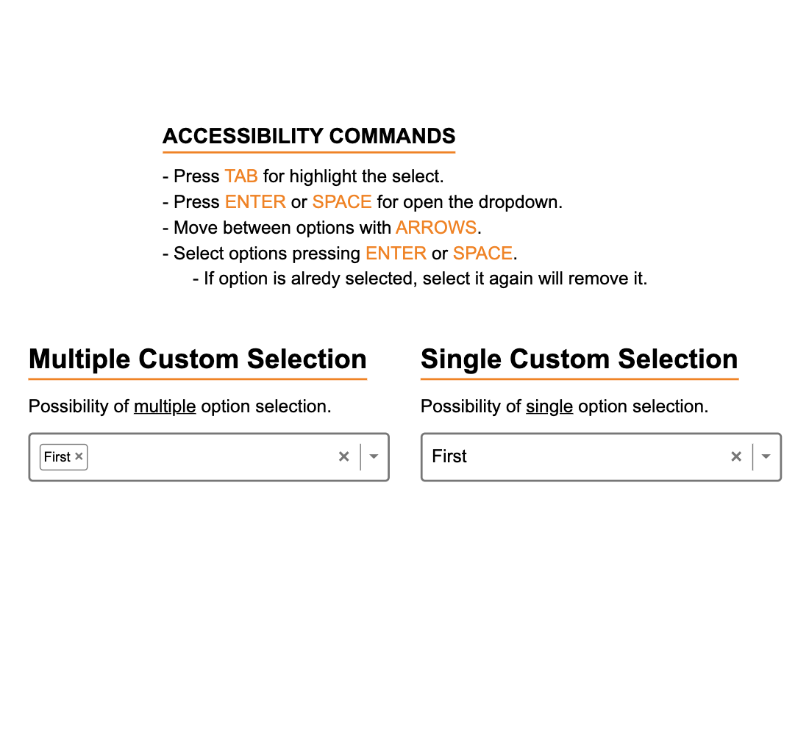

# React-TypeScript Select Component

### Custom select component made with React and TypeScript, single and multiple option selection dropdown with consideration of accessibility practices.
<br />
<br />

## Accessibility Commands

### - Press TAB for highlight the select.
### - Press ENTER or SPACE for open the dropdown.
### - Move between options with ARROWS.
### - Select options pressing ENTER or SPACE.
### &nbsp;&nbsp;&nbsp;&nbsp;&nbsp;&nbsp; - If option is alredy selected, select it again will remove it.

<br>
<br>

## Install dependencies

```
npm install
```

## Start development server

```
npm start
```

<br>

## Screens

